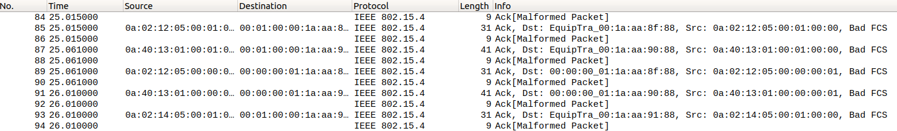

# Sample output of zdo_startup

run.sh: 
```
run ns
run coordinator
18:22:45.029 517 /home/alan/SmarthomeSim/test/zdo_startup/zdo_start_zc.c:125 Device STARTED OK
ZC STARTED OK
run zr
18:22:54.060 581 /home/alan/SmarthomeSim/test/zdo_startup/zdo_start_zr.c:125 Device STARTED OK
ZR STARTED OK
shutdown...
```

Captured packets:

